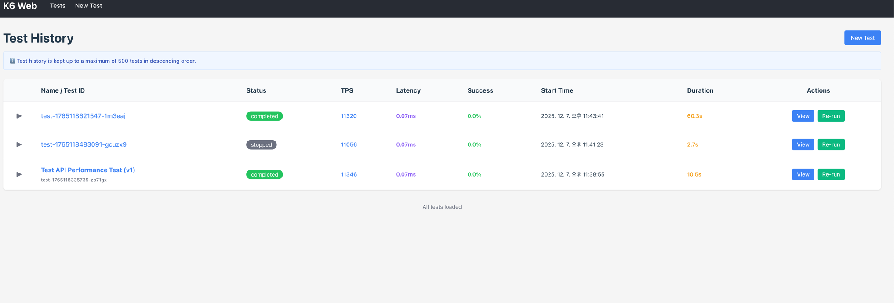
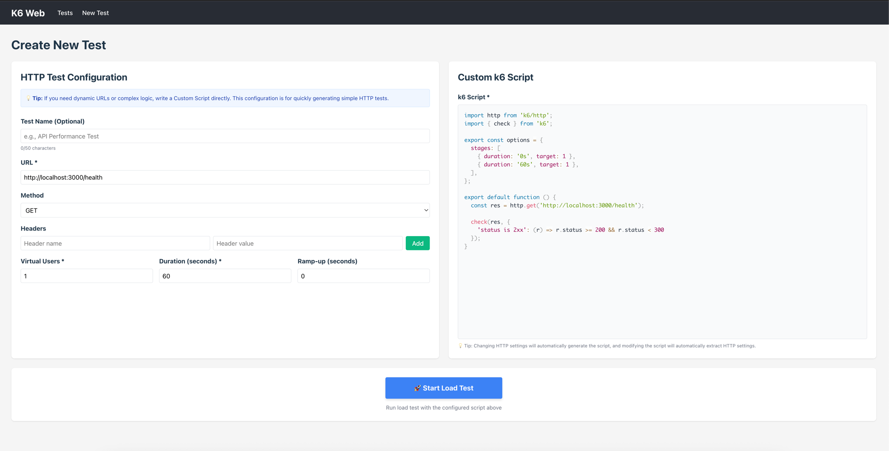
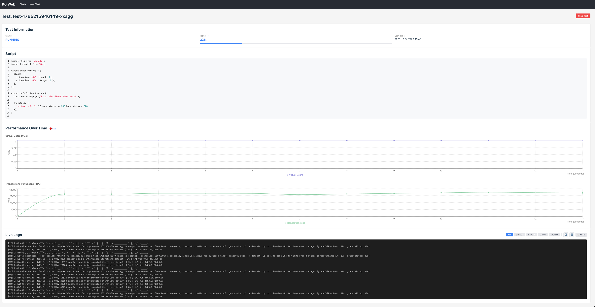
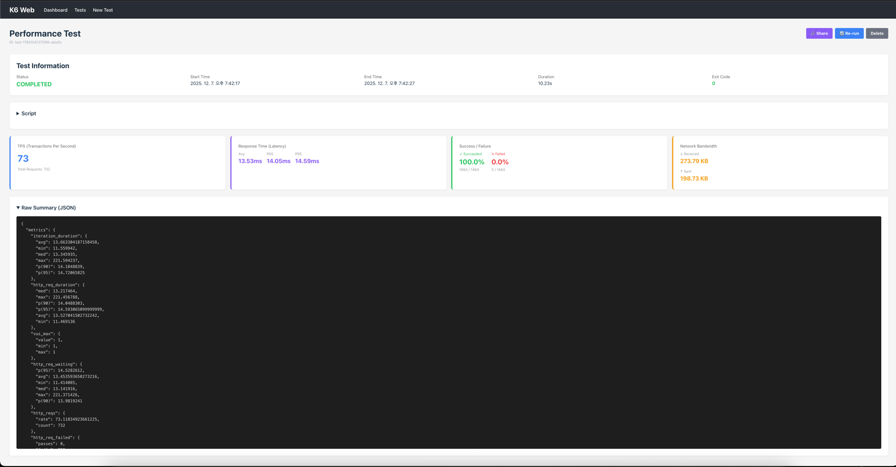

# k6-web

## Overview

k6-web is a web extension for [k6](https://k6.io/), a popular open-source load testing tool. This extension allows users
to run k6 load tests directly from their web browsers.

## Features

- **Browser Integration**: Run k6 scripts directly from your web browser.
- **User-Friendly Interface**: Simple and intuitive UI for managing and executing load tests.
- **Real-Time Results**: View test results in real-time within the browser.
- **Script Management**: Easily create, edit, and manage k6 scripts.

## Target Use Cases

- Lightweight load testing for frontend and API performance validation
- Quick local test execution for rapid verification without infrastructure setup
- Collaboration and shared execution across QA / Engineering / Product teams
- Demo, educational, or training environments for performance testing

## Preview

### 1. Home



### 2. New Test



### 3 Running Test (Live)



### 4. Test Result



## Installation

### Option 1: Docker (Recommended)

#### 1. K6 Agent (k6-web-agent)

```shell
docker pull ghcr.io/k6-web/k6-web-agent:latest
docker run -p 3000:3000 \
  -e PORT=3000 \
  -e K6_BASE_PATH=/tmp/k6 \
  -e MAX_RESULT_FILES=500 \
  ghcr.io/k6-web/k6-web-agent:latest
```

#### 2. K6 Web (k6-web-front)

```shell
docker pull ghcr.io/k6-web/k6-web:latest
docker run -p 5173:5173 \
  -e VITE_API_URL=http://localhost:3000 \
  ghcr.io/k6-web/k6-web:latest
```

#### Environment Variables

##### k6-web-agent

| Variable           | Description                              | Default   |
|--------------------|------------------------------------------|-----------|
| `PORT`             | Server port number                       | `3000`    |
| `LOG_LEVEL`        | Logging level (error, warn, info, debug) | `info`    |
| `K6_BASE_PATH`     | Base directory for k6 data               | `/tmp/k6` |
| `MAX_RESULT_FILES` | Maximum number of result files to keep   | `500`     |

##### k6-web-front

| Variable       | Description      | Default                 |
|----------------|------------------|-------------------------|
| `VITE_API_URL` | K6 Agent API URL | `http://localhost:3000` |

### Option 2: Build from Source

#### 1. K6 Web

Node.js (>= 20) is required.

```shell
git clone https://github.com/k6-web/k6-web
cd k6-web/k6-front

# Change Environment Variables if needed (.env)

npm install
npm run build
npm start
```

#### 2. K6 Agent

Node.js (>= 20) and k6 are required.

```shell
git clone https://github.com/k6-web/k6-web
cd k6-web/k6-agent

# Change Environment Variables if needed (.env)

npm install
npm run build
npm start
```
