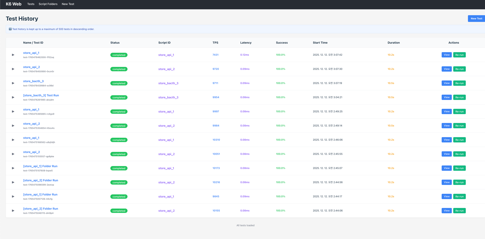
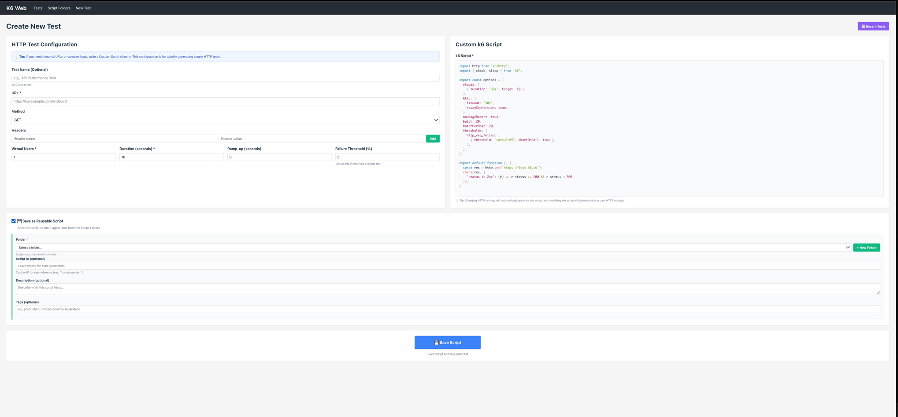
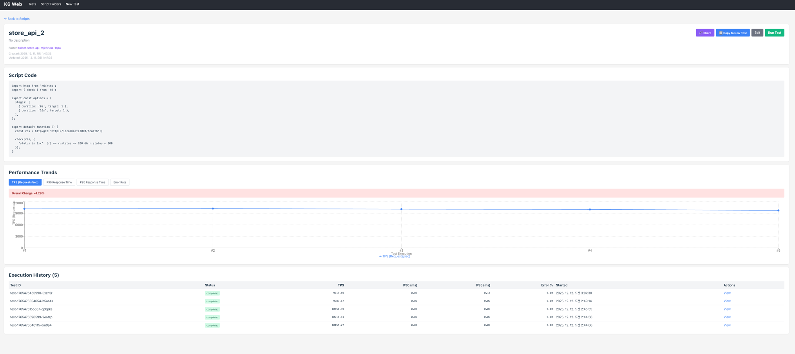
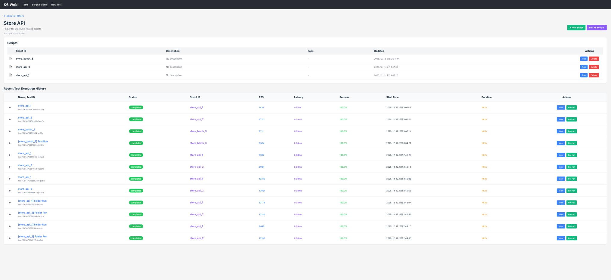

# k6-web

## Overview

**k6-web** is a web-based extension for [k6](https://k6.io/), a popular open-source load testing tool.  
With k6-web, you can run and manage k6 load tests directly from your browser.

## Features

- **Browser Integration**  
  Run k6 scripts directly in your browser

- **User-Friendly Interface**  
  An intuitive UI for creating, editing, organizing, and executing load test scripts.

- **Real-Time Monitoring**  
  Observe performance metrics as the test is running.

- **Detailed Results**  
  Inspect TPS, latency, and additional performance indicators after test completion.

- **Script & Folder Management**  
  Save frequently used scripts, organize them into folders, and run them individually or as a group.

## Target Use Cases

- Lightweight load testing for frontend or backend API validation
- Quick verification without provisioning additional infrastructure
- Collaborative testing among QA, Engineering, and Product teams
- Training, demo, or sandbox environments for introducing load testing

## Preview

### 1. Home



### 2. New Test



**Run k6 scripts in real time without redeploying your application.**  
Execute load tests instantly without setting up additional environments or triggering new deployments.

### 3. Running Test (Live)


**Monitor load test performance in real time.**  
Key performance metrics update continuously as the test is running.

### 4. Test Result


**View detailed metrics such as TPS, latency, and more.**  
Analyze system throughput, response times, and overall performance characteristics.

### 5. Script



**Save frequently used scripts and track performance trends over time.**  
Re-running the same script helps you identify performance improvements or regressions.

### 6. Script Folder



**Organize scripts into folders and execute them as a group.**  
Ideal for scenario-based or large-scale test suites.

## Installation

### Option 1: Docker (Recommended)

#### 1. K6 Agent (k6-web-agent)

```shell
docker pull ghcr.io/k6-web/k6-web-agent:latest
docker run -p 3000:3000 \
  -e PORT=3000 \
  -e K6_BASE_PATH=/tmp/k6 \
  -e MAX_RESULT_FILES=500 \
  -e MAX_FOLDERS=50 \
  -e MAX_SCRIPTS_PER_FOLDER=20 \
  ghcr.io/k6-web/k6-web-agent:latest
```

#### 2. K6 Web (k6-web-front)

```shell
docker pull ghcr.io/k6-web/k6-web:latest
docker run -p 5173:5173 \
  -e VITE_API_URL=http://localhost:3000 \
  ghcr.io/k6-web/k6-web:latest
```

#### Environment Variables

##### k6-web-agent

| Variable                  | Description                              | Default   |
|---------------------------|------------------------------------------|-----------|
| `PORT`                    | Server port number                       | `3000`    |
| `LOG_LEVEL`               | Logging level (error, warn, info, debug) | `info`    |
| `K6_BASE_PATH`            | Base directory for k6 data               | `/tmp/k6` |
| `MAX_RESULT_FILES`        | Maximum number of result files to keep   | `500`     |
| `MAX_FOLDERS`             | Maximum number of folders                | `50`      |
| `MAX_SCRIPTS_PER_FOLDER`  | Maximum number of scripts per folder     | `20`      |

##### k6-web-front

| Variable       | Description      | Default                 |
|----------------|------------------|-------------------------|
| `VITE_API_URL` | K6 Agent API URL | `http://localhost:3000` |

### Option 2: Build from Source

#### 1. K6 Web

Node.js (>= 20) is required.

```shell
git clone https://github.com/k6-web/k6-web
cd k6-web/k6-front

# Change Environment Variables if needed (.env)

npm install
npm run build
npm start
```

#### 2. K6 Agent

Node.js (>= 20) and k6 are required.

```shell
git clone https://github.com/k6-web/k6-web
cd k6-web/k6-agent

# Change Environment Variables if needed (.env)

npm install
npm run build
npm start
```
